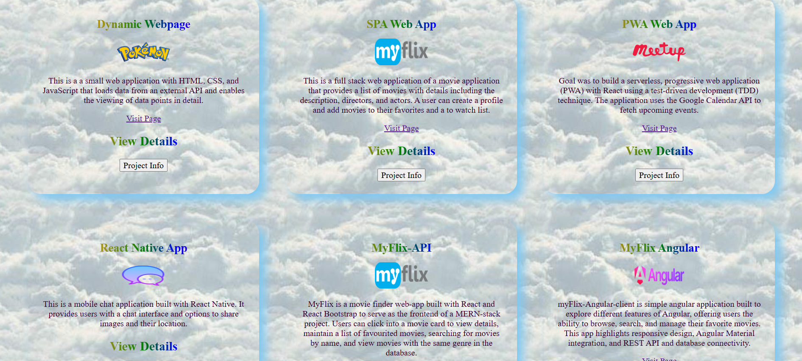

## My Portfolio Website 🌟

Welcome to my portfolio website! This is a showcase of my journey as a full-stack developer, highlighting my skills, projects, and creativity. As a mother of three, this website also reflects my determination to grow and thrive in the tech industry while balancing my personal and professional life.

---

## 🌟 Key Features

- **About Me**: Learn more about my background, journey into tech, and what drives me as a developer.

- **Projects**: Explore the projects I've worked on, complete with live demos and GitHub repositories.

- **Skills**: A detailed list of my technical skills, tools, and technologies I’m proficient in.

- **Blog/Articles**: Insights, challenges, and lessons learned while navigating my career transition into tech.
Blog: 
**[https://www.canva.com/design/DAGcQgt2eqE/1a8hq30_CbukCAcoQn3tKg/view?utm_content=DAGcQgt2eqE&utm_campaign=designshare&utm_medium=link2&utm_source=uniquelinks&utlId=h50e402277a#1]** 

**[https://www.canva.com/design/DAGZKnGaqf8/IZoxc_ua9LF3ji53hrUUng/view?utm_content=DAGZKnGaqf8&utm_campaign=designshare&utm_medium=link2&utm_source=uniquelinks&utlId=ha794c08ba3]**  

- **Contact Me**: An easy way to reach out for collaborations, job opportunities, or networking.

---

## 🛠️ Technologies Used

This portfolio website is built using:

- **Frontend**: 
    - HTML
    - CSS
    - JavaScript
    - Frameworks like Angular/React (customize this based on what you used).
- **Backend**: 
    - Node.js
    - Express.js (if applicable).
- **Styling**:
    - Bootstrap/Material UI/Sass for responsive and visually appealing designs.
- **Hosting**: 
    - Deployed on platforms like GitHub Pages, Netlify, or Vercel.

---

## ✨ Highlights

- **Responsive Design**: 
Optimized for all devices, ensuring a seamless user experience.
- **Dynamic Content**: 
Integrated projects section, which fetches project data dynamically from my GitHub or local JSON files.
- **Accessible Design**: 
Compliant with web accessibility standards for inclusive usage.
- **Creative Elements**: 
Includes photography and design pieces as a reflection of my creative pursuits.

---

## 💼 How to Explore

Navigate through the About Me section to get a glimpse of my personal and professional journey.
Check out the Projects section for a detailed view of the applications I’ve built, complete with descriptions and links.
Visit the Blog to read about my experiences and growth in the tech field.
Use the Contact Me form to get in touch.

---

## 🚀 Future Enhancements
1. **Add a dark mode toggle for better usability.**
2. **Include a testimonials section.**
3. **Add more interactive features, such as project filters.**

---

## 📬 Get in Touch

Feel free to reach out if you're interested in collaborating or just want to connect!

Email: [dash.baijayanti@gmail.com]
LinkedIn: [https://www.linkedin.com/in/baijayanti-dash/]
GitHub: [https://github.com/dash-baijayanti]

 
